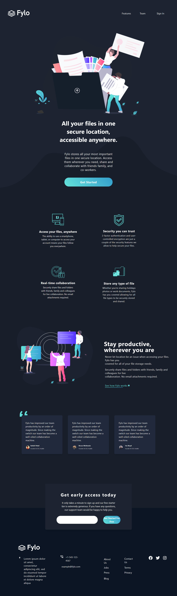

# Frontend Mentor - Fylo dark theme landing page solution

This is a solution to the [Fylo dark theme landing page challenge on Frontend Mentor](https://www.frontendmentor.io/challenges/fylo-dark-theme-landing-page-5ca5f2d21e82137ec91a50fd). Frontend Mentor challenges help you improve your coding skills by building realistic projects. 

## Table of contents

- [Overview](#overview)
  - [The challenge](#the-challenge)
  - [Screenshot](#screenshot)
  - [Links](#links)
- [My process](#my-process)
  - [Built with](#built-with)
  - [What I learned](#what-i-learned)
  - [Continued development](#continued-development)
  - [Useful resources](#useful-resources)
- [Author](#author)

## Overview

### The challenge

Users should be able to:

- View the optimal layout for the site depending on their device's screen size
- See hover states for all interactive elements on the page

### Screenshot

### Links

- Solution URL: [Solution](https://www.frontendmentor.io/solutions/responsive-landing-page-with-tailwindcss-PLJBTH3jU)
- Live Site URL: [Live URl](https://richd0tcom.github.io/fylo-dark-theme-landing-page/)

## My process

### Built with

- Semantic HTML5 markup
- Flexbox
- CSS Grid
- Mobile-first workflow
- [Tailwind CSS](https://tailwindcss.com) - CSS Framework

### What I learned

More on media queies and breakpoints

### Continued development

some SVG's disappear on resize and then pop-up once more. I'd like to fix that. 
### Useful resources

- [Pixel Perfect]() - Chrome Extension for near pixel perfect development.  I really liked this extension and will use it going forward.

## Author

- Frontend Mentor - [@yourusername](https://www.frontendmentor.io/profile/Richd0tcom)
- Twitter - [@0xRICHd0tCom](https://www.twitter.com/0xRICHd0tCom)

